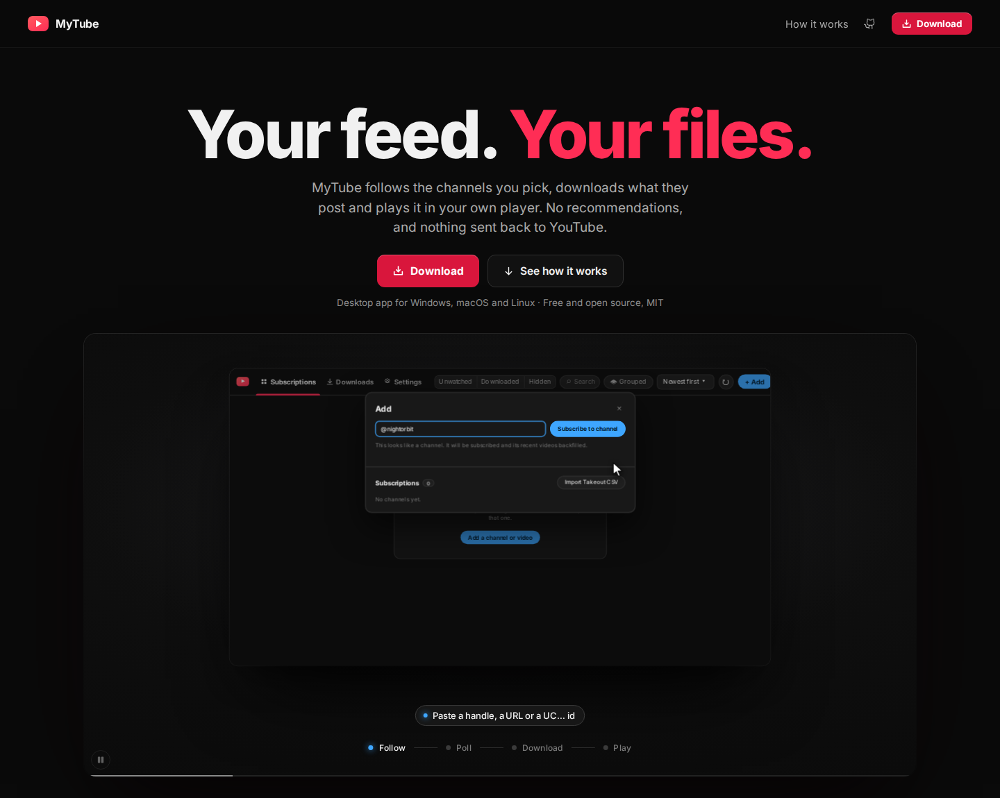

# MyTube

**Your feed. Your files.** MyTube follows the channels you pick, downloads what they post and plays it in your own player. No recommendations, and nothing sent back to YouTube.

[](https://mytube.blyat.uk/)

**Website: [mytube.blyat.uk](https://mytube.blyat.uk/)**

## Download

Get the latest build from the [releases page](https://github.com/blyat-uk/mytube/releases/latest):

| OS | File |
|---|---|
| Windows 10/11 (x64) | `-windows-x64-setup.exe` (per-user installer, no admin rights needed) |
| macOS 11+ (Apple Silicon) | `-macos-arm64.dmg` |
| Linux x86_64 | `-linux-x86_64.AppImage`, `.deb` or `.rpm` |

On first launch MyTube downloads whatever it cannot find on your system: yt-dlp (kept up to date automatically), ffmpeg and deno. For members-only videos, pick the browser you are signed in to YouTube with under Settings → YouTube cookies. Firefox works everywhere; Chromium-based browsers cannot be read on Windows, so use Firefox or a `cookies.txt` file there.

## Run from source

[Bun](https://bun.sh) and a stable Rust toolchain, plus the [Tauri prerequisites](https://v2.tauri.app/start/prerequisites/) for your OS.

```bash
git clone https://github.com/blyat-uk/mytube.git
cd mytube
bun install
bun run tauri dev
```

## Develop

```bash
bun run test                                        # frontend tests
cargo test --manifest-path src-tauri/Cargo.toml     # backend tests
bun run tauri build                                 # release build for this OS
```

Pushing a `vX.Y.Z` tag that matches the version in `tauri.conf.json`, `Cargo.toml` and `package.json` builds, tests and publishes a release for all three platforms.

## License

[MIT](LICENSE)
