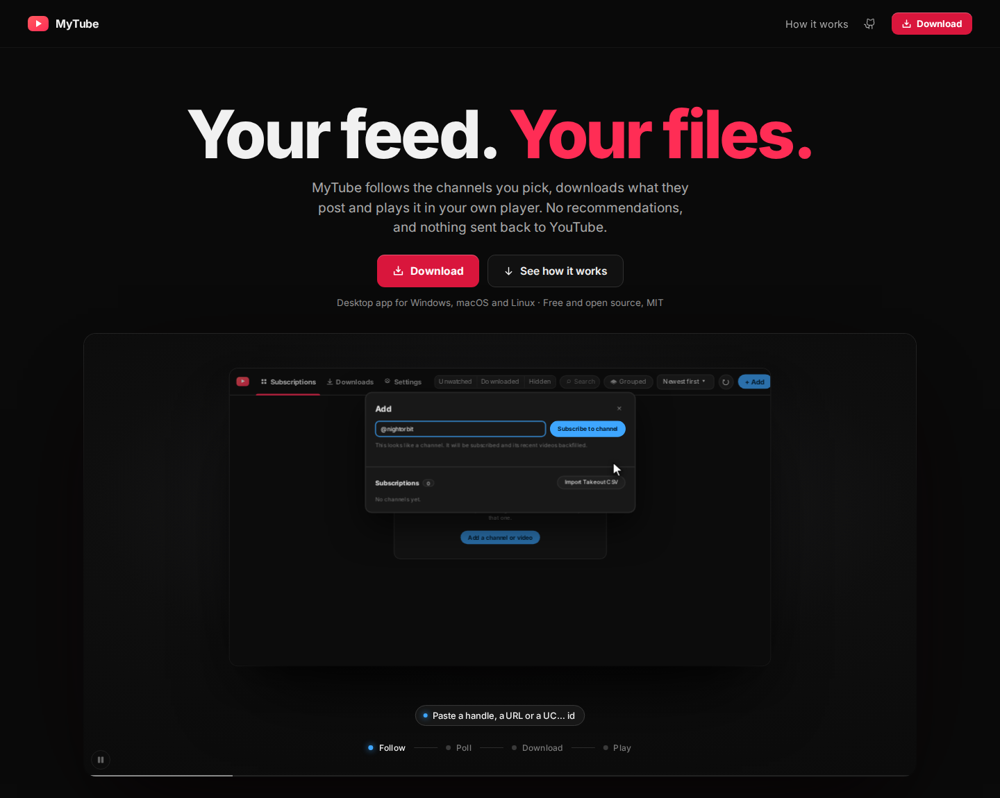

# MyTube

**Your feed. Your files.** MyTube follows the channels you pick, downloads what they post and plays it in your own player. No recommendations, and nothing sent back to YouTube.

[](https://mytube.blyat.uk/)

**Website: [mytube.blyat.uk](https://mytube.blyat.uk/)**

## Download

Get the latest build from the [releases page](https://github.com/blyat-uk/mytube/releases/latest):

| OS | File |
|---|---|
| Windows 10/11 (x64) | `-windows-x64-setup.exe` (per-user installer, no admin rights needed) |
| macOS 11+ (Apple Silicon) | `-macos-arm64.dmg` |
| Linux x86_64, Debian / Ubuntu 22.04+ | `-linux-x86_64.deb` |
| Linux x86_64, Fedora / openSUSE | `-linux-x86_64.rpm` |
| Linux x86_64, anything else | `-linux-x86_64.AppImage` |

Each release lists every file and what it is for, plus `SHA256SUMS.txt` to verify them against.

## First run

MyTube uses three programs it does not ship: **yt-dlp**, **ffmpeg** and **deno** (the JavaScript runtime yt-dlp needs for YouTube). The first time it starts it downloads whichever of them it cannot find on your system: about 150 MB, straight from each publisher's own releases, each checked against its published SHA-256, into your local data folder:

| OS | Tools folder |
|---|---|
| Windows | `%LOCALAPPDATA%\mytube\bin` |
| macOS | `~/Library/Application Support/mytube/bin` |
| Linux | `~/.local/share/mytube/bin` |

Unpacked, all three take roughly 500 MB on disk (the static ffmpeg and ffprobe builds are about 350 MB of that). Any tool already on your system is used instead and not downloaded. Settings → Tools shows where each one came from; yt-dlp keeps itself up to date once a day.

Downloads go out with the YouTube cookies of a browser you are signed in to (Settings → YouTube cookies). Automatic uses whichever browser on the machine is signed in to YouTube, or the one used most recently when none is, and the list marks which are signed in. That is what reaches members-only videos and keeps YouTube's bot checks at bay. On Windows, yt-dlp cannot read Chrome, Edge or other Chromium browsers; on macOS they ask for Keychain access. A cookies file exported from any browser works everywhere: a Netscape `cookies.txt`, a JSON export (Cookie-Editor, EditThisCookie, Cookie Quick Manager, Playwright, Selenium), or a `name=value; …` cookie header. MyTube reads it, tells you what it found, and gives yt-dlp its own copy, so your file is never modified.

## Platform notes

- **Windows:** the installer is not code-signed; SmartScreen may ask you to confirm (More info → Run anyway).
- **macOS:** the app is not notarized. After copying it to Applications, open it with right-click → Open, or allow it under System Settings → Privacy & Security, or run `xattr -dr com.apple.quarantine /Applications/mytube.app`.
- **macOS 27 and browser cookies:** macOS 27 keeps every other app out of the data of Firefox, Chrome, Brave and Edge, so Settings lists them as "no access" (Safari's cookies have always needed the same). Turn MyTube on under System Settings → Privacy & Security → Full Disk Access and restart it, or use a cookies file. The per-browser switch macOS adds under Files & Folders does not stick: it lasts only until MyTube quits. MyTube is ad-hoc signed, so macOS ties Full Disk Access to one exact build; after an update, switch it off and on again (or remove MyTube from the list and add it back).
- **Linux:** the `.deb` and `.rpm` pull in WebKitGTK 4.1 themselves. If the AppImage does not start, install your distribution's FUSE 2 package (`libfuse2` / `fuse2`) or run it with `--appimage-extract-and-run`. The tray icon needs a StatusNotifierItem host (built into KDE; GNOME needs the AppIndicator extension).

## Moving your library from a terminal

Settings → Backup & transfer also works with no window at all, for a machine you can only reach over SSH (Linux and macOS). To carry the library at home to a laptop:

```sh
ssh -t home mytube export                  # writes ~/mytube-export-YYYY-MM-DD.zip on home
scp 'home:mytube-export-*.zip' .
mytube import mytube-export-2026-10-02.zip # or Settings → Backup & transfer → Import…
```

`mytube import` shows what the archive holds and then asks: Merge or Replace, which channels, whether to apply its settings, and finally to confirm. Esc at any question cancels before anything is written. Every question has a flag (`mytube export --help`, `mytube import --help`). With no terminal attached, such as a cron job or `ssh home mytube export` without `-t`, nothing is asked: thumbnails are included, every channel is merged and the settings are applied. `--replace` then needs `--yes` as well.

The command is `mytube` with the `.deb` and `.rpm`, the AppImage file itself (`./mytube-v3.1.0-linux-x86_64.AppImage export`), and `/Applications/mytube.app/Contents/MacOS/mytube` on macOS. On Windows, use Settings → Backup & transfer.

If MyTube is running on the machine you import into, its window shows the import after its next poll.

## Uninstalling

Uninstalling removes the app but not your data or the tools it downloaded. Delete these folders as well to remove everything:

| OS | Settings, library and thumbnails | Downloaded tools |
|---|---|---|
| Windows | `%APPDATA%\mytube` | `%LOCALAPPDATA%\mytube\bin` (the uninstaller leaves it) |
| macOS | `~/Library/Application Support/mytube` | `~/Library/Application Support/mytube/bin` |
| Linux | `~/.config/mytube` | `~/.local/share/mytube/bin` |

Downloaded videos stay wherever you saved them.

## Run from source

[Bun](https://bun.sh) and a stable Rust toolchain, plus the [Tauri prerequisites](https://v2.tauri.app/start/prerequisites/) for your OS.

```bash
git clone https://github.com/blyat-uk/mytube.git
cd mytube
bun install
bun run tauri dev
```

## Develop

```bash
bun run test                                        # frontend tests
cargo test --manifest-path src-tauri/Cargo.toml     # backend tests
bun run tauri build                                 # release build for this OS
```

Pushing a `vX.Y.Z` tag that matches the version in `tauri.conf.json`, `Cargo.toml` and `package.json` builds, tests and publishes a release for all three platforms. Its notes are the commits since the previous tag followed by the downloads table, nothing else, so anything a user needs to know goes in this README.

## License

[MIT](LICENSE)
